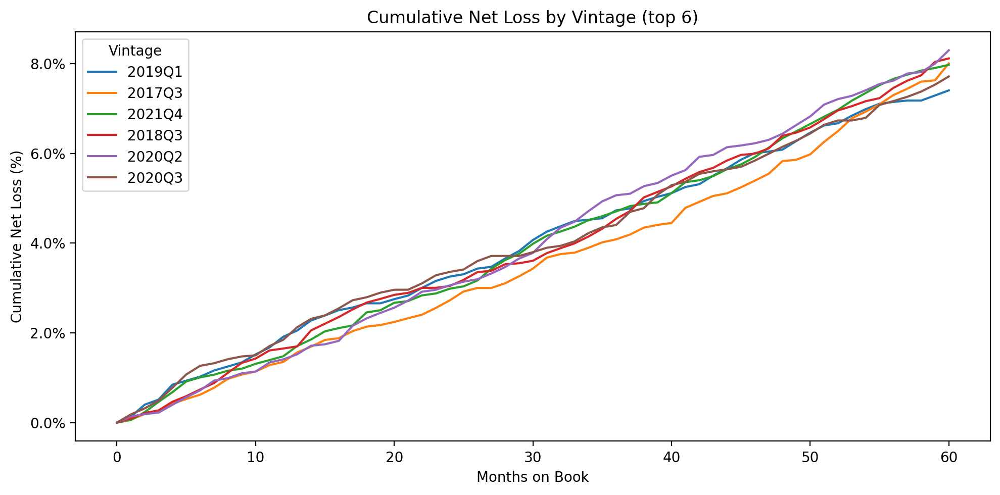
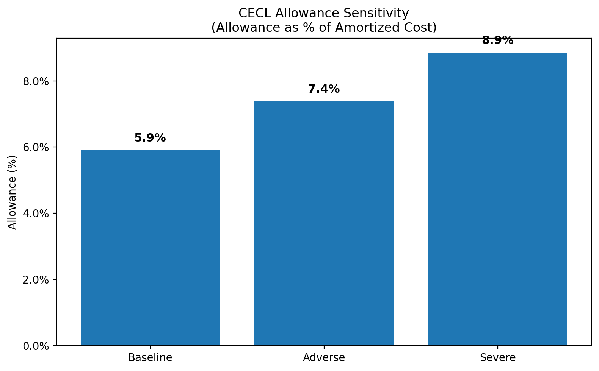

# CECL Vintage Loss & Allowance Sensitivity (Python)

Builds **vintage loss curves** (cumulative net loss % by months-on-book) and a **CECL-lite allowance sensitivity** (Baseline/Adverse/Severe) on a consumer-loan sample (loans_sample.csv).

## Quickstart
```bash
python3 -m venv .venv
source .venv/bin/activate
pip install -r requirements.txt
python src/compute_vintages_and_cecl.py
cd ~/Projects/cecl-vintage-sensitivity
source .venv/bin/activate

# List the generated files
ls -lh figures
ls -lh results

# Open the folders in Finder (so you can see the PNGs/CSVs)
open figures
open results

# Peek a CSV right in Terminal (optional):
head -n 5 results/vintage_summary.csv
### 3) Stage everything (now that .gitignore exists)
```bash
git add -A
git status

### 3) Stage everything (now that .gitignore exists)
```bash
git add -A
git status
cat > README.md << 'MD'
# CECL Vintage Loss & Allowance Sensitivity (Python)

Builds **vintage loss curves** (cumulative net loss % by months-on-book) and a **CECL-lite allowance sensitivity** (Baseline/Adverse/Severe) on a consumer-loan sample (loans_sample.csv).

## Key Outputs




- [Vintage summary (12/24/36/60M & final) — CSV](results/vintage_summary.csv)  
  *Note: loss % values are fractions (e.g., 0.0213 = 2.13%).*

## How to interpret

- **Vintage Curves:** Each line = an origination quarter (vintage). Y-axis is cumulative **net** loss as a % of original balance. Check the 12/24/36-month points for early-tenor loss slope; steeper = higher risk.
- **CECL Allowance Sensitivity:** Bars show reserve as % of amortized cost under Baseline/Adverse/Severe scenarios using PD × LGD × EAD.
- **Vintage Summary (CSV):** Loss % values are **fractions** (e.g., `0.0213` = **2.13%**).
  
### Assumptions (demo)
- PD mapped by grade (A–G), LGD = 85%, EAD = 65% of origination.
- Swap in your own PD/LGD/EAD models and macro overlays when using real data.

## Quickstart
```bash
python3 -m venv .venv
source .venv/bin/activate
pip install -r requirements.txt
python src/compute_vintages_and_cecl.py
### 3) Stage everything (now that .gitignore exists)
```bash
git add -A
git status
